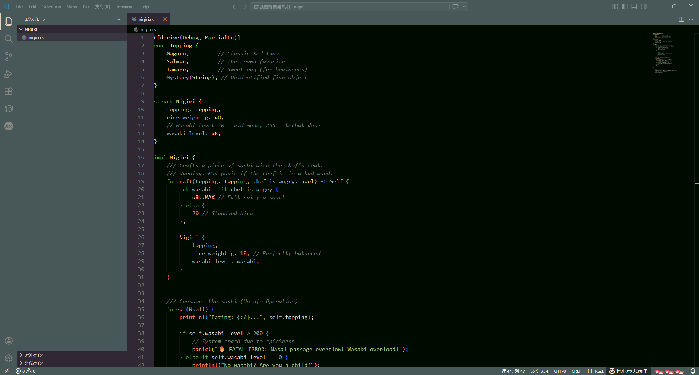
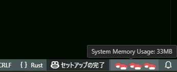
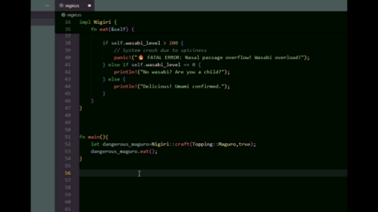
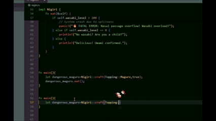
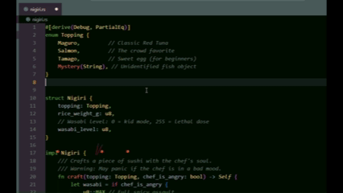
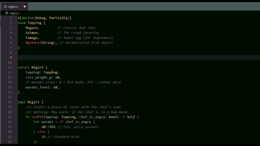

  <h1>🍣 SUSHI-Theme v1.9.0</h1>
  
<b>Welcome to the best Sushi restaurant in your editor.</b>

  <blockquote style="background: #fff3cd; color: #856404; padding: 10px; border-left: 5px solid #ffeeba; display: inline-block;">
    ⚠️ <b>Warning:</b> May cause sudden cravings for sushi.
  </blockquote>
    
  

  

<h2>🍣 Fresh Features</h2>

<table style="width: 100%; border: none; border-collapse: collapse;">
  <tr>
    <td style="width: 55%; text-align: center; padding: 20px; vertical-align: middle;">
      
    </td>
    <td style="width: 45%; padding: 20px; vertical-align: middle;">
      <h3>🍣 SUSHI Memory Indicator</h3>
      
Check your system memory usage easily right in your status bar.

      
Low memory = A few pieces of sushi. 
      High memory = A full plate of sushi!

      
Hover to see detailed System & Extension memory stats.

    </td>
  </tr>
  
  <tr>
    <td style="width: 45%; padding: 20px; vertical-align: middle;">
      <h3>🥢 Omakase Typing Effects</h3>
      
Every keystroke drops a piece of sushi! Enjoy a smooth, zero-lag experience powered by a high-performance ECS engine built from scratch specifically for this extension.

      
Build your combo to upgrade your sushi. Choose your favorite topping: <b>Maguro, Ikura, Ebi, Matcha</b>, or let the chef decide with <b>Random</b> mode.

    </td>
    <td style="width: 55%; text-align: center; padding: 20px; vertical-align: middle;">
      
    </td>
  </tr>

  <tr>
    <td style="width: 55%; text-align: center; padding: 20px; vertical-align: middle;">
      
    </td>
    <td style="width: 45%; padding: 20px; vertical-align: middle;">
      <h3>🔥 FEVER TIME!</h3>
      
Type fast and don't break your combo! Hit the target (default: 50) to trigger <b>FEVER MODE</b>.

      
Enjoy a shower of golden glowing sushi, active line highlights, and a blazing status bar animation.

    </td>
  </tr>
</table>

  

<tr>
    <td style="width: 45%; padding: 20px; vertical-align: middle;">
      <h3>💥 Physics: Stack 'em or Bounce 'em!</h3>
      
Turn on <b>Enable Particle Collision</b> to give your sushi real-world physics! Depending on your settings, you can completely change how they interact:

      <ul>
        <li><b>Sushi Mountain:</b> Set <b>Particle Restitution</b> to <code>0</code> and watch the fresh sushi pile up at the bottom of your screen.</li>
        <li><b>Sushi Pinball:</b> Maximize <b>Particle Restitution</b> and <b>Particle Speed Multiplier</b> to trigger explosive, bouncing chaos!</li>
      </ul>
      
<i>Tip: Increase the <b>Particle Lifespan Multiplier</b> to keep the party going longer!</i>

      <blockquote style="font-size: 0.9em; border-left: 3px solid #ff9800; padding-left: 10px; margin-left: 0; margin-top: 15px;">
        🍣 <b>Chef's Warning:</b> Just like a real all-you-can-eat buffet, keeping too many bouncing sushis on screen might give your editor a "food coma" (lag). If your VS Code feels a bit stuffed, try lowering the lifespan or turning off collisions!
      </blockquote>
    </td>
    <td style="width: 55%; text-align: center; padding: 20px; vertical-align: middle;">
      
       
      
    </td>
  </tr>

  

<h2>⚙️ Custom Orders (Settings)</h2>

You can customize your sushi experience from VS Code settings (<code>Preferences: Open Settings</code> and search for <code>sushiTheme</code>).

<table style="width: 100%; border-collapse: collapse; text-align: left; border: 1px solid #ddd;">
  <thead style="background-color: #f8f9fa;">
    <tr>
      <th style="padding: 12px; border-bottom: 2px solid #ddd;">Setting Name</th>
      <th style="padding: 12px; border-bottom: 2px solid #ddd; text-align: center;">Default</th>
      <th style="padding: 12px; border-bottom: 2px solid #ddd;">Description</th>
    </tr>
  </thead>
  <tbody>
    <tr>
      <td style="padding: 10px; border-bottom: 1px solid #ddd;"><code>Enable Status Bar</code></td>
      <td style="padding: 10px; border-bottom: 1px solid #ddd; text-align: center;"><code>true</code></td>
      <td style="padding: 10px; border-bottom: 1px solid #ddd;">Show StatusBar (Sushi memory indicator)</td>
    </tr>
    <tr>
      <td style="padding: 10px; border-bottom: 1px solid #ddd;"><code>Effect Type</code></td>
      <td style="padding: 10px; border-bottom: 1px solid #ddd; text-align: center;"><code>random</code></td>
      <td style="padding: 10px; border-bottom: 1px solid #ddd;">Select the flying sushi effect on typing. (Default: Random) <i>Options: maguro, ikura, ebi, matcha, random, none</i></td>
    </tr>
    <tr>
      <td style="padding: 10px; border-bottom: 1px solid #ddd;"><code>Particle Speed Multiplier</code></td>
      <td style="padding: 10px; border-bottom: 1px solid #ddd; text-align: center;"><code>1.3</code></td>
      <td style="padding: 10px; border-bottom: 1px solid #ddd;">Speed multiplier for flying sushi (Default: 1.3. Example: 1.3 is 1.3x speed). <i>Min: -20 / Max: 20</i></td>
    </tr>
    <tr>
      <td style="padding: 10px; border-bottom: 1px solid #ddd;"><code>Particle Lifespan Multiplier</code></td>
      <td style="padding: 10px; border-bottom: 1px solid #ddd; text-align: center;"><code>1.0</code></td>
      <td style="padding: 10px; border-bottom: 1px solid #ddd;">Sets the multiplier for the sushi's display time (lifespan). A larger value keeps it on the screen longer, but consumes more memory. <i>Min: 0.1 / Max: 10.0</i></td>
    </tr>
    <tr>
      <td style="padding: 10px; border-bottom: 1px solid #ddd;"><code>Bounce Top Distance</code></td>
      <td style="padding: 10px; border-bottom: 1px solid #ddd; text-align: center;"><code>200</code></td>
      <td style="padding: 10px; border-bottom: 1px solid #ddd;">Distance in pixels the sushi flies upward from the typing cursor before bouncing back (Set to 0 to disable bouncing). <i>Min: 0 / Max: 1000</i></td>
    </tr>
    <tr>
      <td style="padding: 10px; border-bottom: 1px solid #ddd;"><code>Bounce Bottom Distance</code></td>
      <td style="padding: 10px; border-bottom: 1px solid #ddd; text-align: center;"><code>0</code></td>
      <td style="padding: 10px; border-bottom: 1px solid #ddd;">Sets the distance to the bottom wall (floor). Set to 0 for no floor (infinite fall). The larger the value, the lower it will bounce. <i>Min: 0 / Max: 1000</i></td>
    </tr>
    <tr>
      <td style="padding: 10px; border-bottom: 1px solid #ddd;"><code>Bounce Left Distance</code></td>
      <td style="padding: 10px; border-bottom: 1px solid #ddd; text-align: center;"><code>0</code></td>
      <td style="padding: 10px; border-bottom: 1px solid #ddd;">Sets the distance to the left wall. Set to 0 to disable the left wall. <i>Min: 0 / Max: 2000</i></td>
    </tr>
    <tr>
      <td style="padding: 10px; border-bottom: 1px solid #ddd;"><code>Bounce Right Distance</code></td>
      <td style="padding: 10px; border-bottom: 1px solid #ddd; text-align: center;"><code>0</code></td>
      <td style="padding: 10px; border-bottom: 1px solid #ddd;">Sets the distance to the right wall. Set to 0 to disable the right wall. <i>Min: 0 / Max: 2000</i></td>
    </tr>
    <tr>
      <td style="padding: 10px; border-bottom: 1px solid #ddd;"><code>Enable Particle Collision</code></td>
      <td style="padding: 10px; border-bottom: 1px solid #ddd; text-align: center;"><code>false</code></td>
      <td style="padding: 10px; border-bottom: 1px solid #ddd;">Enable physics collisions between sushi particles. (Might impact performance if spawning many particles)</td>
    </tr>
    <tr>
      <td style="padding: 10px; border-bottom: 1px solid #ddd;"><code>Particle Restitution</code></td>
      <td style="padding: 10px; border-bottom: 1px solid #ddd; text-align: center;"><code>0.8</code></td>
      <td style="padding: 10px; border-bottom: 1px solid #ddd;">Bounciness factor when particles collide. 1.0 is perfectly elastic, 0 is inelastic. <i>Min: 0.0 / Max: 2.0</i></td>
    </tr>
    <tr>
      <td style="padding: 10px; border-bottom: 1px solid #ddd;"><code>Particle Mass Multiplier</code></td>
      <td style="padding: 10px; border-bottom: 1px solid #ddd; text-align: center;"><code>1.0</code></td>
      <td style="padding: 10px; border-bottom: 1px solid #ddd;">Multiplier for the mass (weight) of sushi particles. <i>Min: 0.1 / Max: 10.0</i></td>
    </tr>
    <tr>
      <td style="padding: 10px; border-bottom: 1px solid #ddd;"><code>Particle Friction Multiplier</code></td>
      <td style="padding: 10px; border-bottom: 1px solid #ddd; text-align: center;"><code>1.0</code></td>
      <td style="padding: 10px; border-bottom: 1px solid #ddd;">Multiplier for how slippery the sushi is. Higher values make them stop faster. <i>Min: 0.1 / Max: 5.0</i></td>
    </tr>
    <tr>
      <td style="padding: 10px; border-bottom: 1px solid #ddd;"><code>Particle Bounciness Multiplier</code></td>
      <td style="padding: 10px; border-bottom: 1px solid #ddd; text-align: center;"><code>1.0</code></td>
      <td style="padding: 10px; border-bottom: 1px solid #ddd;">Multiplier for how bouncy specific sushi types are (e.g., Ikura is bouncier than Maguro). <i>Min: 0.0 / Max: 5.0</i></td>
    </tr>
    <tr>
      <td style="padding: 10px; border-bottom: 1px solid #ddd;"><code>Combo Unit</code></td>
      <td style="padding: 10px; border-bottom: 1px solid #ddd; text-align: center;"><code>5</code></td>
      <td style="padding: 10px; border-bottom: 1px solid #ddd;">Keystrokes to upgrade sushi (Default: 5) <i>Min: 1 / Max: 10000</i></td>
    </tr>
    <tr>
      <td style="padding: 10px; border-bottom: 1px solid #ddd;"><code>Combo Timeout Ms</code></td>
      <td style="padding: 10px; border-bottom: 1px solid #ddd; text-align: center;"><code>1500</code></td>
      <td style="padding: 10px; border-bottom: 1px solid #ddd;">Time (in ms) before combo resets (Default: 1500) <i>Min: 500 / Max: 100000</i></td>
    </tr>
    <tr>
      <td style="padding: 10px; border-bottom: 1px solid #ddd;"><code>Fever Trigger Combo</code></td>
      <td style="padding: 10px; border-bottom: 1px solid #ddd; text-align: center;"><code>50</code></td>
      <td style="padding: 10px; border-bottom: 1px solid #ddd;">Number of combos to start Fever Time. <i>Min: 10 / Max: 10000</i></td>
    </tr>
    <tr>
      <td style="padding: 10px; border-bottom: 1px solid #ddd;"><code>Fever Duration Ms</code></td>
      <td style="padding: 10px; border-bottom: 1px solid #ddd; text-align: center;"><code>10000</code></td>
      <td style="padding: 10px; border-bottom: 1px solid #ddd;">How long Fever Time lasts in milliseconds (e.g., 10000 = 10 seconds). <i>Min: 1 / Max: 100000</i></td>
    </tr>
    <tr>
      <td style="padding: 10px; border-bottom: 1px solid #ddd;"><code>Fever Spawn Count</code></td>
      <td style="padding: 10px; border-bottom: 1px solid #ddd; text-align: center;"><code>5</code></td>
      <td style="padding: 10px; border-bottom: 1px solid #ddd;">Number of sushi dropped per keystroke in Fever Time. <i>Min: 1 / Max: 20</i></td>
    </tr>
    <tr>
      <td style="padding: 10px; border-bottom: 1px solid #ddd;"><code>FPS (Frame Rate)</code></td>
      <td style="padding: 10px; border-bottom: 1px solid #ddd; text-align: center;"><code>30</code></td>
      <td style="padding: 10px; border-bottom: 1px solid #ddd;">Set the frame rate (draws per second) for effects. Higher values provide smoother animations but increase editor load. <i>Options: 15, 30, 60, 120 (Actual rate may be limited by VS Code architecture)</i></td>
    </tr>
    <tr>
      <td style="padding: 10px; border-bottom: 1px solid #ddd;"><code>Throttle Ms</code></td>
      <td style="padding: 10px; border-bottom: 1px solid #ddd; text-align: center;"><code>80</code></td>
      <td style="padding: 10px; border-bottom: 1px solid #ddd;">Set the minimum time (in milliseconds) between effect renders. Increase this value (e.g., 100-150) if your editor lags during continuous typing. (Default: 80) <i>Min: 16 / Max: 1000</i></td>
    </tr>

  </tbody>
</table>

  

  
<i>Ready to order? Download now and enjoy your meal! 🍣✨</i>

